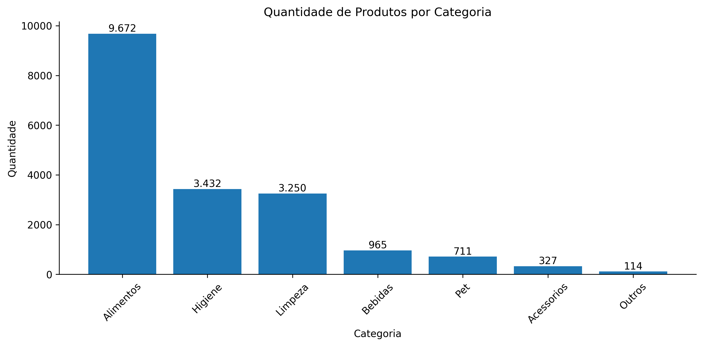
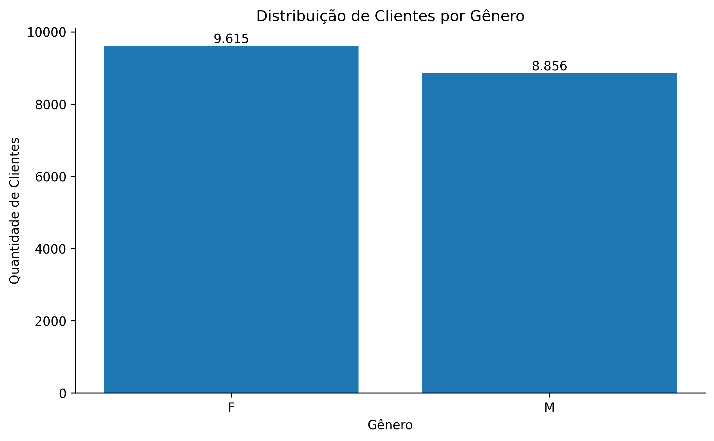
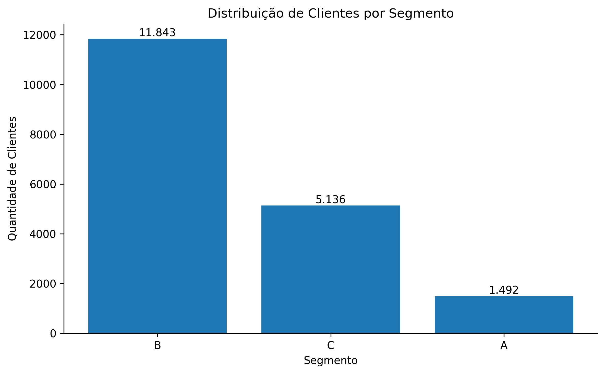
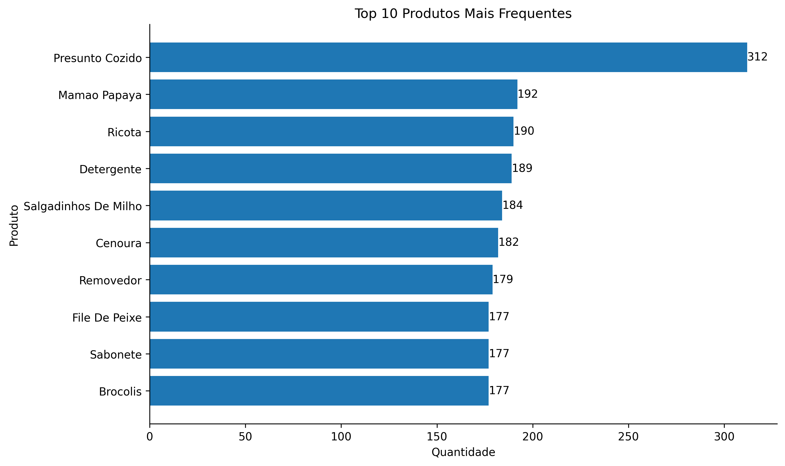

# Mini Projeto de Análise de Dados - Loja de Varejo

## Sobre o Projeto

Este projeto tem como objetivo realizar uma Análise Exploratória de Dados (EDA) em uma base de transações de uma loja de varejo, aplicando técnicas de limpeza, tratamento, transformação e visualização de dados utilizando Python.

A análise busca identificar padrões de consumo, perfil dos clientes, comportamento de compra e possíveis oportunidades de negócio a partir dos dados disponíveis.

---

## Objetivos

* Realizar a limpeza e preparação dos dados.
* Identificar problemas de qualidade na base.
* Analisar o perfil dos clientes.
* Investigar a distribuição dos produtos e categorias.
* Avaliar o comportamento temporal das compras.
* Produzir visualizações que auxiliem na tomada de decisão.
* Gerar insights a partir dos dados analisados.

---

## Estrutura do Projeto

```text
Miniprojeto_LuizFabioDaCruz_V2/
│
├── data/
│   └── base_varejo.csv
│
├── notebooks/
│   └── main.ipynb
│
├── output/
│   ├── grafico_produtos_categoria.png
│   ├── grafico_clientes_genero.png
│   ├── grafico_clientes_segmento.png
│   ├── grafico_quantidade_filhos.png
│   ├── grafico_top10_produtos.png
│   └── grafico_evolucao_compras.png
│
├── utils/
│   ├── config.py
│   ├── evidencias.py
│   ├── formatacao.py
│   └── limpeza.py
│
├── requirements.txt
├── README.md
└── .gitignore
```

### Descrição dos Módulos

| Arquivo         | Descrição                                                                      |
| --------------- | ------------------------------------------------------------------------------ |
| `config.py`     | Configurações gerais do projeto e definição de diretórios.                     |
| `evidencias.py` | Funções para análise exploratória inicial e evidências da qualidade dos dados. |
| `formatacao.py` | Funções para padronização e formatação dos dados.                              |
| `limpeza.py`    | Funções para limpeza e tratamento dos dados.                                   |

---

## Metodologia

O projeto foi desenvolvido seguindo as seguintes etapas:

1. Importação dos dados.
2. Análise exploratória inicial.
3. Identificação de problemas de qualidade.
4. Limpeza e transformação dos dados.
5. Geração de estatísticas descritivas.
6. Construção de visualizações.
7. Extração de insights.

---

## Tratamento dos Dados

Durante a análise foram identificados e tratados diversos problemas na base.

### Problemas Encontrados

* Presença de espaços em branco no início e/ou final dos valores.
* Colunas não nomeadas (`Unnamed`) sem relevância para a análise.
* Registros com datas inválidas ou ausentes.
* Registros duplicados.
* Categoria de produto inconsistente (`#N/D`).

### Etapas de Limpeza

* Remoção das colunas `Unnamed`.
* Padronização dos nomes de produtos.
* Padronização das categorias de produtos.
* Conversão da coluna `DATA` para o tipo `datetime`.
* Identificação de registros com datas ausentes.
* Análise de registros duplicados.
* Separação dos dados válidos para análises temporais.

---

## Resumo da Base

| Métrica                | Valor   |
| ---------------------- | ------- |
| Total de registros     | 830.000 |
| Total de colunas       | 14      |
| Registros duplicados   | 96.553  |
| Datas ausentes         | 58,4%   |
| Categorias de produtos | 7       |

---

## Visualizações

### Distribuição de Produtos por Categoria



### Distribuição de Clientes por Gênero



### Distribuição de Clientes por Segmento



### Top 10 Produtos Mais Frequentes



---

## Principais Insights

### Produtos

* A categoria Alimentos apresentou a maior quantidade de registros da base.
* As categorias Limpeza e Higiene também apresentaram forte representatividade.
* Alguns produtos apresentam elevada frequência de ocorrência, indicando padrões recorrentes de compra.

### Clientes

* A distribuição dos clientes por gênero mostrou uma composição equilibrada da base.
* A maior parte dos clientes possui entre 0 e 2 filhos.
* Os segmentos de clientes apresentam distribuições distintas, possibilitando futuras estratégias de segmentação.

### Qualidade dos Dados

* Foi identificado um percentual elevado de datas ausentes (58,4%).
* A presença de registros duplicados reforça a importância da etapa de limpeza antes da análise.

### Comportamento Temporal

* A evolução das compras ao longo do tempo permite identificar tendências e possíveis sazonalidades.
* A análise temporal foi realizada apenas com registros que possuíam datas válidas.

---

## Tecnologias Utilizadas

* Python 3.12
* Pandas
* NumPy
* Matplotlib
* Jupyter Notebook
* Git
* GitHub

---

## Como Executar

### 1. Clonar o repositório

```bash
git clone <url-do-repositorio>
```

### 2. Acessar a pasta do projeto

```bash
cd Miniprojeto_LuizFabioDaCruz_V2
```

### 3. Criar o ambiente virtual

#### Linux

```bash
python3 -m venv venv
```

#### Windows

```powershell
python -m venv venv
```

### 4. Ativar o ambiente virtual

#### Linux

```bash
source venv/bin/activate
```

#### Windows (PowerShell)

```powershell
venv\Scripts\Activate.ps1
```

#### Windows (CMD)

```cmd
venv\Scripts\activate.bat
```

### 5. Instalar as dependências

```bash
pip install -r requirements.txt
```

### 6. Executar o Jupyter Notebook

```bash
jupyter notebook
```

### 7. Abrir o notebook principal

```text
notebooks/main.ipynb
```

---

## Autor

Luiz Fábio da Cruz

Projeto desenvolvido como atividade prática de Análise de Dados utilizando Python.

